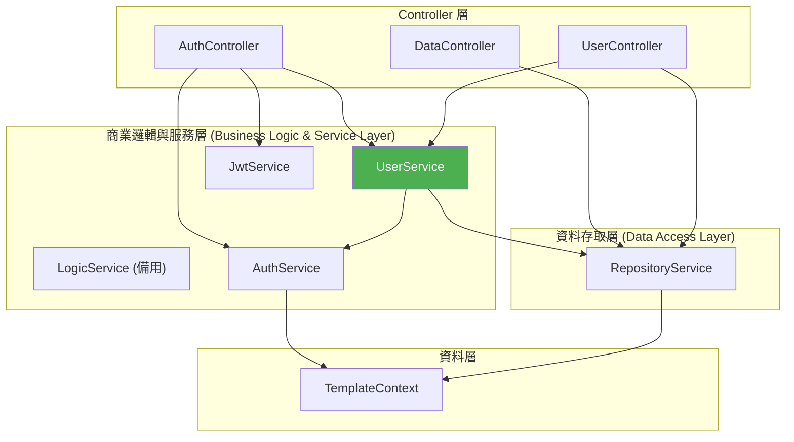

# DotNetApiTemplate - 後端 API 開發樣板

此專案為基於 ASP.NET Core 的後端 API 開發樣板，採用 .NET 10.0 框架，專注於高效能、安全性、高可擴展性及清晰的分層架構。本專案整合了 JWT 驗證、Active Directory (AD) 網域登入、自動化操作日誌 (Generic Repository + Audit Log), AutoMapper 映射以及 Swagger 開發文件。

---

## ⚙️ 環境需求與準備 (Prerequisites)

在開始使用本專案前，請確認您的開發環境已安裝以下工具：

- **.NET SDK**: .NET 10.0 SDK 或以上版本。
- **資料庫管理系統**: LocalDB 或 SQL Server 實例。
- **EF Core CLI 工具**: 用於執行資料庫遷移指令，如未安裝請在終端機中執行：
  ```bash
  dotnet tool install --global dotnet-ef
  ```

---

## 🚀 快速開始

### 1. 克隆專案 (Clone)
使用 Git 將專案複製至您的開發主機：
```bash
git clone https://github.com/OliverLiou/DotNet-Api-Template.git
cd DotNet-Api-Template
```

### 2. 設定設定檔 `appsettings.json`
專案根目錄下附帶有 `appsettings.template.jsonc` 樣板檔。請複製該檔案並命名為 `appsettings.json`：

- **Windows PowerShell**:
  ```powershell
  Copy-Item appsettings.template.jsonc appsettings.json
  ```
- **Windows Command Prompt (cmd)**:
  ```cmd
  copy appsettings.template.jsonc appsettings.json
  ```

接著，開啟 `appsettings.json` 並修改檔案內的必要資訊：
- **`ConnectionStrings.DefaultConnection`**: 設定您的 SQL Server 資料庫連線字串。
- **`JwtSettings`**:
  - `SecretKey`: 設定隨機且足夠長度的金鑰以進行 JWT 簽章驗證（生產環境請嚴格保密）。
  - `Issuer`: 發行者標識。
  - `Audience`: 接收者標識。
  - `ExpiryInHours`: Access Token 有效時數（預設 2 小時）。
  - `RefreshTokenExpiryInHours`: Refresh Token 有效時數（預設 24 小時）。
- **`Cors.AllowedOrigins`**: 設定前端來源網址陣列以允許跨來源請求 (預設為 `["http://localhost:3000"]`)。
- **`LdapSettings`**:
  - `Server`: 設定 Active Directory/LDAP 伺服器的 FQDN，供 [AuthService](Services/AuthService.cs) 做跨平台 AD 驗證使用。
  - `ServiceUsername`: 網域服務帳號（用於查詢使用者屬性）。
  - `ServicePassword`: 網域服務帳號密碼。
- **`SystemName`**: 系統背景或定時排程操作者名稱（預設為 `System`），用於資料庫背景寫入時的操作日誌紀錄。

### 3. 建立並執行資料庫遷移 (Migrations) 與資料植入 (Seed Data)
由於本專案採用 Code First 設計，且 `Migrations` 目錄預設為空，您需要先手動建立初始的資料庫遷移檔，再套用至資料庫：

1. **建立遷移檔案**：
   在專案根目錄下執行以下指令（此處以 `Init` 作為遷移名稱，您也可以自訂名稱）：
   ```bash
   dotnet ef migrations add Init
   ```
   執行後，系統會自動在 `Migrations` 資料夾下產生對應的資料庫 Schema 定義檔案。

2. **套用遷移至資料庫**：
   執行以下指令，將遷移結構套用並建立實際的資料庫與資料表：
   ```bash
   dotnet ef database update
   ```
   *(註：本專案的 [TemplateContext](Models/Context/TemplateContext.cs) 已設定 Seed Data，在套用遷移時會自動建立預設的角色 `Admin` 與 `User`，並建立預設的系統管理員帳號 **`admin`**，預設密碼為 **`Admin123!`**，可用於初步的功能開發與測試。)*

### 4. 啟動專案
執行以下指令編譯並啟動 API 服務：
```bash
dotnet run
```
專案啟動後，開啟瀏覽器並導航至以下網址以瀏覽 Swagger 偵錯文件：
👉 **[http://localhost:5001/swagger](http://localhost:5001/swagger)**
*(註：或依啟動設定導航至 https://localhost:7151/swagger)*

---

## 📂 專案目錄結構 (Folder Structure)

本專案結構劃分清晰，依功能將代碼分類存放：

```text
DotNet-Api-Template/
├── Controllers/         # API 控制器層，負責接收 HTTP 請求 (如 AuthController.cs, UserController.cs, DataController.cs)
├── DTOs/                # 資料傳輸物件層，細分為 Requests (請求) 與 Responses (回應，含統一錯誤回應格式 ErrorResponse.cs)
├── Interfaces/          # 系統核心服務與邏輯層的介面定義 (如 IRepositoryService.cs, IUserService.cs, ILogicService.cs)
├── Middlewares/         # 自定義中介軟體 (如全域異常處理器 GlobalExceptionHandler.cs)
├── Migrations/          # EF Core Code First 資料庫遷移歷史紀錄
├── Models/              # 資料庫實體與資料庫上下文
│   ├── Context/         # DbContext 實作 (TemplateContext.cs)
│   ├── Entities/        # 資料庫主實體類別 (如 User.cs, Role.cs, Table1.cs)
│   └── EntityLogs/      # 操作日誌實體類別 (如 UserLog.cs, UserRoleLog.cs, Table1Log.cs)
├── Properties/          # 專案啟動與偵錯配置檔 (launchSettings.json)
├── Services/            # 實作服務層，包括商業邏輯 (UserService.cs, LogicService.cs)、AD驗證 (AuthService.cs)、JWT安全 (JwtService.cs) 與倉儲 (RepositoryService.cs)
├── Settings/            # 強型別組態定義 (如 JwtSettings.cs, LdapSettings.cs)
├── AutoMapping.cs       # AutoMapper 映射設定檔 (AutoMapping.cs)
├── Program.cs           # 應用程式進入點與 DI 容器註冊中心 (Program.cs)
└── DotNetApiTemplate.csproj
```

---

## 🏗️ 系統架構與設計理念

專案採用嚴謹的分層架構 (**Controller -> Business Logic & Service -> Repository -> DbContext**)，以維持低耦合力及高可測試性。以下是整體架構關係圖：



### 1. Controllers (控制器層)
* **設計理念**：僅負責端點接收、路由分派、DTO 驗證宣告，不包含任何商業邏輯或直接的資料庫查詢。
* **統一錯誤回應**：所有 API 在遇到業務邏輯錯誤或異常時，一律透過 `ErrorResponse` 以 `{ "Message": "錯誤訊息說明" }` 格式回傳，確保前端能有一致的攔截與處理邏輯，同時保障底層內部例外資訊不外洩。
* **主要控制器**：
  * **[AuthController](Controllers/AuthController.cs)**：處理身分認證的入口。封裝了 AD 登入、一般登入與 JWT 權杖生命週期的邏輯。
    * `POST /api/Auth/Login`：使用資料庫的帳號密碼進行一般驗證（如內建的 `admin` 帳號），成功後簽發 Access Token 與 Refresh Token。
    * `POST /api/Auth/AdLogin`：使用帳號密碼進行 AD 網域驗證，成功後透過 `UserService` 於資料庫建立/同步使用者實體，並簽發 Access Token 與 Refresh Token。
    * `GET /api/Auth/UserProfile`：取得當前 Token 中使用者的基本資料與角色資訊。
    * `POST /api/Auth/RefreshToken`：使用有效 Refresh Token 續簽即將過期的 Access Token。
  * **[UserController](Controllers/UserController.cs)**：管理使用者帳號及角色權限。
    * `GET /api/User/FindUsers/{currentPage}/{pageSize}`：分頁查詢使用者資料（只列出 active 狀態，依建立時間排序，支援關鍵字查詢）。
    * `PUT /api/User/UpdateUser/{userId}`：更新使用者的基本資料（如姓名、Email、電話與啟用狀態）。
    * `PUT /api/User/UpdateUserRoles/{userId}`：更新使用者的角色清單（**限制僅限 Admin 角色執行**），於同一個 Transaction 中完成角色異動與 UserRoleLog 寫入。
  * **[DataController](Controllers/DataController.cs)**：資料存取示範控制器。展示如何利用泛型 `RepositoryService` 快速提供 RESTful CRUD API。
    * `GET /api/Data/GetTable1/{table1Id}`、`POST /api/Data/Table1SingleSave`、`DELETE /api/Data/DeleteTable1Data`。
    * `GET /api/Data/FindTable1/{currentPage}/{pageSize}`：具備分頁、關鍵字模糊搜尋及多欄位動態排序的進階分頁查詢。

### 2. Business Logic & Services (商業邏輯與服務層)
* **設計理念**：負責處理核心的業務流程與邏輯。我們將業務邏輯解耦，並區分為特定的業務服務（例如 `UserService`）與基礎底層服務（例如 `AuthService`、`JwtService`）。
* **主要服務**：
  * **[UserService](Services/UserService.cs)** (介面：[IUserService](Interfaces/IUserService.cs))：
    * 專責處理與使用者相關的商業邏輯，例如 `CreateOrUpdateUserOnLoginAsync`（處理 AD 登入成功後的使用者同步與登入時間更新）、`UpdateUserAsync`、`UpdateUserRolesAsync` 等。
    * 包含 `MapAdUserInfoToUser` 方法，將 AD 使用者資訊 DTO (`AdUserInfoDto`) 專責對應至系統的 `User` 實體，落實單一職責原則。
  * **[LogicService](Services/LogicService.cs)** (介面：[ILogicService](Interfaces/ILogicService.cs))：
    * 備用之一般業務邏輯服務（目前為空介面與類別實作），供後續擴充其他非使用者相關之複雜業務場景使用。
  * **[AuthService](Services/AuthService.cs)** (介面：[IAuthService](Interfaces/IAuthService.cs))：
    * 跨平台 AD/LDAP 驗證：封裝與作業系統相關的 Active Directory (LDAP) 連線細節，並支援非 Windows 平台下的編譯降級，維護平台的移植性。
    * 資料庫密碼驗證：實作 `PasswordAuthenticateAsync`，透過內建的 `UserManager` 提供一般的帳號密碼登入驗證。
  * **[JwtService](Services/JwtService.cs)** (介面：[IJwtService](Interfaces/IJwtService.cs))：負責 JWT 權杖的簽發以及對傳入 Token 的安全解析與驗證，內含防範 Algorithm Confusion 的簽章校驗邏輯。

### 3. Repository (資料存取與日誌層)
* **設計理念**：資料庫存取層，封裝資料庫查詢細節與交易 (Transaction) 管理。
* **主要服務**：
  * **[RepositoryService<T, TLog>](Services/RepositoryService.cs)** (介面：[IRepositoryService<T, TLog>](Interfaces/IRepositoryService.cs))：
    * **動態欄位搜尋**：在 `FindDataAsync` 中利用 Expression Tree 動態反射物件的所有 String 與 Numeric 屬性，在資料庫端直接生成包含 `Contains` 與 `ToString` 的 SQL 查詢，免除手寫多個 OR 條件的困擾。
    * **自動異動日誌 (Auto Audit Log)**：所有的寫入與刪除 (Save, Delete) 都會在同一個 Transaction 內同步透過 AutoMapper 映射生成對應的 Log 實體 (實作 [ILogInterface](Interfaces/ILogInterface.cs))，並自動填入操作者姓名、執行時間及操作方法 (Create/Update/Delete)，確保稽核紀錄不遺漏。
    * **交易感知 (Transaction Awareness)**：自動偵測外部是否已開啟交易；若無，則自行建立並於成功後提交；若有，則直接使用外部交易，將 Commit 決定權交回給上層 Logic/User 服務。

### 4. 統一錯誤處理機制 (Unified Error Handling)
* **全域異常捕獲**：註冊了 **[GlobalExceptionHandler](Middlewares/GlobalExceptionHandler.cs)** 中介軟體，用於捕獲所有未處理的例外狀況 (Exception)。
* **API 錯誤格式一致化**：所有 API 內部發生的驗證失敗、權限不足或系統錯誤，皆回傳 **[ErrorResponse](DTOs/Responses/ErrorResponse.cs)** 格式的 JSON 物件：
  ```json
  {
    "Message": "錯誤原因說明"
  }
  ```
  這簡化了前端 `onResponseError` 攔截器 (Interceptor) 的設計，使其僅需統一讀取回應中的 `Message` 屬性即可直接呈現給使用者，而不必針對各種 HTTP Status Code 編寫重複且冗長的剖析程式碼。
* **敏感資訊防護**：全域異常捕獲時，系統會將詳細的 Exception Stack Trace 寫入後端 Log，但對前端僅回傳安全的通用說明文字（如「伺服器發生內部錯誤，請聯繫系統管理員。」），避免洩漏底層實體或資料庫結構等安全性風險。

---

## 🔑 開發測試驗證流程 (Testing Walkthrough)

您可以使用 Swagger 進行以下驗證測試：

### 1. 使用預設 Admin 帳號登入 (一般登入)
- 開啟 Swagger，展開 `POST /api/Auth/Login` 端點並點擊 **Try it out**。
- 輸入預設帳號與密碼：
  - `UserName`: `admin`
  - `Password`: `Admin123!`
- 點擊 **Execute**，如登入成功，將在 Response Body 取得 JWT 的 `AccessToken` 與 `RefreshToken`。
- 複製 `AccessToken` 供後續授權使用。

### 2. 模擬/實際 AD 登入 (選用)
- 若您已完成 `appsettings.json` 中的 `LdapSettings` 設定，可點擊 `POST /api/Auth/AdLogin` 的 **Try it out**。
- 輸入符合您 AD 網域之 `UserName` 與 `Password`。
- 點擊 **Execute**，驗證成功後同樣會於資料庫同步該使用者，並回傳 JWT 的 `AccessToken`。

### 3. 在 Swagger 中進行授權 (Authorize)
- 複製步驟 1 或 2 取得的 `AccessToken`。
- 點選 Swagger 頁面右上角的 **Authorize** 按鈕。
- 在 Value 欄位中填入：`Bearer <你的AccessToken>`（注意 `Bearer` 與 Token 之間必須有一個空格）。
- 點選 **Authorize** 並關閉視窗。

### 4. 驗證授權端點與角色 API
- **驗證設定檔**：點選 `GET /api/Auth/UserProfile` 端點，點擊 **Try it out** 隨後點擊 **Execute**。
  - 若回傳 200 OK 且正確顯示您的帳號資訊及角色 (例如 `Admin`)，代表 JWT 驗證與解析成功。
- **測試使用者管理**：點選 `GET /api/User/FindUsers/1/10` 端點，輸入搜尋關鍵字並點擊 **Execute**，驗證分頁查詢。
- **測試角色變更 (Admin 限定)**：以 `admin` 身分登入時，呼叫 `PUT /api/User/UpdateUserRoles/{userId}` 調整其他使用者的角色清單，並檢查資料庫的 `UserRoleLog` 是否確實新增日誌紀錄。

---

## 🛠️ 開發擴充指南 (Developer's Extensibility Guide)

若您想為系統新增一個資料表，並讓其自動具備「異動日誌紀錄（Audit Log）」功能，請遵循以下步驟（以新增資料表 `Table2` 為例）：

1. **定義共用基底欄位**
   In `Models/Entities` 目錄下定義 `Table2Base`，放置商業屬性：
   ```csharp
   public class Table2Base
   {
       public virtual int Table2Id { get; set; }
       public string? Name { get; set; }
   }
   ```

2. **建立主要 Entity**
   在 `Models/Entities` 下建立繼承 `Table2Base` 的 `Table2`，並使用 `[Key]` 標示主鍵：
   ```csharp
   using System.ComponentModel.DataAnnotations;

   public class Table2 : Table2Base
   {
       [Key]
       public override int Table2Id { get; set; }
   }
   ```

3. **建立對應的 Log Entity**
   在 `Models/EntityLogs` 下建立繼承 `Table2Base` 且實作 `ILogInterface` 的 `Table2Log`：
   ```csharp
   using System;
   using System.ComponentModel.DataAnnotations;
   using DotNetApiTemplate.Interfaces;

   public class Table2Log : Table2Base, ILogInterface
   {
       [Key]
       public int Table2LogId { get; set; }
       public required string Method { get; set; }
       public required DateTime ExecuteTime { get; set; }
       public required string EditorName { get; set; }
   }
   ```

4. **設定 AutoMapper 映射**
   在 [AutoMapping.cs](AutoMapping.cs) 的建構子中註冊雙向映射關係：
   ```csharp
   CreateMap<Table2, Table2Log>().ReverseMap();
   ```

5. **註冊至 DbContext**
   在 [TemplateContext.cs](Models/Context/TemplateContext.cs) 中，加入對應的 `DbSet` 註冊：
   ```csharp
   public DbSet<Table2> Table2s { get; set; }
   public DbSet<Table2Log> Table2Logs { get; set; }
   ```

6. **在服務中直接使用 Repository**
   現在，您只需在控制器或 Logic/User 層直接注入 `IRepositoryService<Table2, Table2Log>`：
   ```csharp
   public class Table2Controller(IRepositoryService<Table2, Table2Log> table2Repository) : ControllerBase
   {
       // 所有的 Add, Update, Delete 操作都會自動在 DB Transaction 內連動寫入 Table2Log！
   }
   ```
   如此便完成了功能擴充，無需手寫任何記錄 Log 的重複性程式碼。
